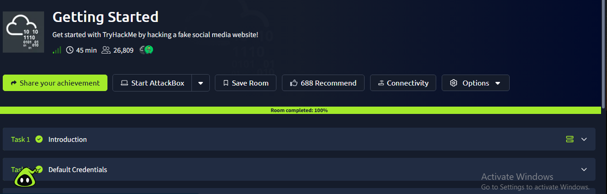

# Getting Started

## TryHackMe Room

**Room:** Getting Started  
**Platform:** TryHackMe

## Objective

The objective of this room was to learn how to navigate the TryHackMe platform and understand the basic workflow of completing cybersecurity learning rooms.

## What I Learned

In this room, I learned how TryHackMe is structured and how to work through cybersecurity learning rooms.

I learned how to navigate between tasks, read instructions, interact with the learning environment, answer questions, and track my progress.

This room provided an introduction to hands-on cybersecurity learning through the TryHackMe platform.

## Key Concepts

- TryHackMe platform navigation
- Rooms and tasks
- Hands-on cybersecurity learning
- Task completion
- Learning environment
- Progress tracking

## Key Takeaways

- TryHackMe provides practical cybersecurity learning environments.
- Rooms are divided into tasks that can be completed step by step.
- Reading task instructions carefully is important when working through security labs.
- Hands-on practice is an important part of developing cybersecurity skills.

## Completion Evidence

The screenshot below shows my completed TryHackMe room:

## Status

**Completed**