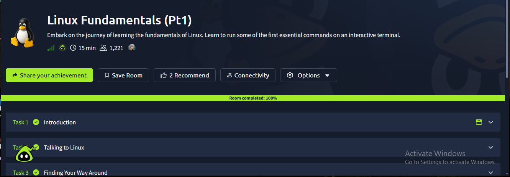

# Linux Fundamentals Part 1

## TryHackMe Room

**Room:** Linux Fundamentals Part 1  
**Platform:** TryHackMe

## Objective

The objective of this room was to learn essential Linux terminal commands, navigate the Linux file system, and build a foundation for using Linux in cybersecurity environments.

## What I Learned

In this room, I learned the fundamentals of working with Linux through the command line.

I practiced navigating directories, listing files, creating directories and files, viewing file contents, and using basic Linux commands.

I also learned why Linux command-line skills are important for cybersecurity, penetration testing, system administration, and CTF environments.

## Important Commands

| Command | Purpose |
|---|---|
| `pwd` | Display the current working directory |
| `ls` | List files and directories |
| `cd` | Change directory |
| `mkdir` | Create a directory |
| `touch` | Create a file |
| `cat` | Display file contents |
| `cp` | Copy files and directories |
| `mv` | Move or rename files |
| `rm` | Remove files |
| `find` | Search for files and directories |
| `man` | View command documentation |

## Key Concepts

- Linux command line
- File system navigation
- Directories and files
- File management
- Terminal commands
- Command documentation
- Linux fundamentals for cybersecurity

## Key Takeaways

- Linux command-line knowledge is an essential cybersecurity skill.
- The terminal provides powerful tools for interacting with a system.
- Understanding the Linux file system helps with security analysis and CTF challenges.
- Learning basic commands provides a foundation for more advanced Linux and security tasks.

## Completion Evidence

The screenshot below shows my completed TryHackMe room:

## Status

**Completed**
