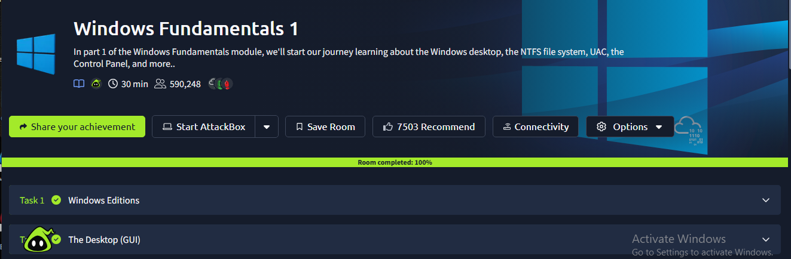

# Windows Fundamentals Part 1

## TryHackMe Room

**Room:** Windows Fundamentals Part 1

**Platform:** TryHackMe

## Objective

The objective of this room was to understand the fundamentals of the Windows operating system and explore important Windows components and features.

## What I Learned

In this room, I explored the basic Windows environment and learned about important components of the Windows operating system.

I learned how Windows manages files, applications, system settings and other core operating system features.

The room also introduced important Windows tools and concepts that are useful for system administration and cybersecurity.

## Key Concepts

- Windows operating system fundamentals
- Windows desktop and user interface
- File system
- System configuration
- Control Panel
- Task Manager
- System administration
- Windows security fundamentals

## Key Takeaways

- Understanding Windows fundamentals is important for cybersecurity professionals.
- Windows provides built-in tools for system management and administration.
- Knowledge of the Windows file system helps with security analysis and investigation.
- System administration concepts are useful when analyzing and securing Windows systems.

## Completion Evidence

The screenshot below shows my completed TryHackMe room:

## Status

**Completed**
